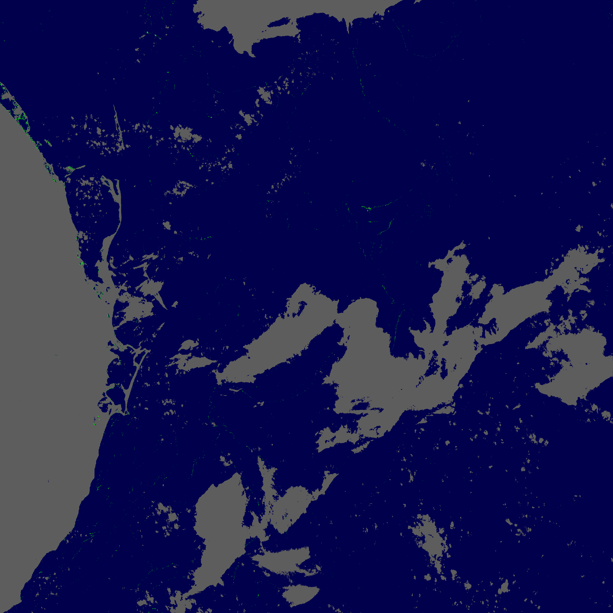

# ASI

A new Machine Learning algorithm for the remote detection of floating sargassum in satellite imagery.

ASI was created during the [Ocean Hackaton](https://www.campusmer.fr/Ocean-Hackathon_-3567-0-0-0.html) 2019, a "hacking" competition organized annually by the [Campus Mondial de la Mer](https://www.campusmer.fr/). The algorithm and project, developed at the Mexico City branch of the contest by a team of Mexican students and researchers in collaboration with several Mexican institutions, [won 1st place](https://www.afd.fr/en/actualites/ocean-hackathon-2019-algorithm-advanced-sargassum-detection) at the international finals in Brest, France.

© 2020 [Sargassum Busters](https://oceanhackathonmex.wixsite.com/sargassumbusters) / [CONABIO](https://www.gob.mx/conabio) / [INECC](https://www.gob.mx/inecc) / [IFAL](https://ifal.mx/)

ASI is free software: you can redistribute it and/or modify it under the terms of the GNU General Public License as published by the Free Software Foundation, either version 3 of the License, or (at your option) any later version.

### Description

Aqua Satus Invenio ("discovery of the waters"), or ASI, uses deep neural networks to detect sargassum in satellite images. It is designed to work with freely-available L2A [Sentinel-2](https://sentinel.esa.int/web/sentinel/missions/sentinel-2) imagery (bottom-of-atmosphere reflectance) at 20 m spatial resolution, much higher than what is typically used.

The neural network is initially trained using Wang & Hu's Alternative Floating Algae Index ([ref](https://www.sciencedirect.com/science/article/abs/pii/S0034425716301833)), but after training it makes predictions independently of the AFAI, and the code is written so that training data generated from other sources could potentially be be used.

The codebase is highly flexible and can output the detection results in several georeferenced formats (GeoTIFF, OpenJPEG2000, GeoJSON) or as raw data to be analyzed elsewhere.

### Requirements

The code is written in Python 3 and has the following third-party libraries as dependencies, all of which can be downloaded and installed using [pip](https://pip.pypa.io/en/stable/):

- [rasterio](https://pypi.org/project/rasterio/): library to handle georeferenced data formats
- [tensorflow2](https://www.tensorflow.org/install): machine learning platform (GPU version recommended!)
- [keras](https://pypi.org/project/Keras/): framework for deep neural networks (using tensorflow)
- [numpy](https://pypi.org/project/numpy/): library for matrix-oriented numerical calculations
- [sentinelsat](https://pypi.org/project/sentinelsat/): API to search for and download Sentinel-2 datasets (not required if the images are obtained through other means)

Optional:

- [matplotlib](https://pypi.org/project/matplotlib/) & [pillow](https://pypi.org/project/Pillow/): only required if direct plotting of results is desired
- [pandas](https://pypi.org/project/pandas/), [geopandas](https://pypi.org/project/geopandas/) & [GDAL](https://pypi.org/project/GDAL/): only required for the polygonization program

### Usage example

Here's a step-by-step example of the utilization of ASI, from downloading data to making the sargassum detection and outputting the result as a GeoTIFF that can be directly loaded e.g. in [QGIS](https://qgis.org/).

**Image search and download**

The [`download_datasets.py`](download_datasets.py) program can search and download Sentinel-2 images using the Copernicus Open Access Hub API. You can obtain a Copernicus username / password [here](https://scihub.copernicus.eu/dhus/#/self-registration).

The program's options should be self-explanatory. In this example we'll download an image of the 16QEJ tile obtained by Sentinel-2 on 6 July 2019 (very little cloud cover and clear sargassum filaments):

    Copernicus_username = "<SET USERNAME>"
    Copernicus_password = "<SET PASSWORD>"
    tiles = ["16QEJ"]
    data_dir = "./"
    start_date = datetime.date(2019, 7, 6)
    end_date = datetime.date(2020, 7, 6)
    unzip = True

Running the program with these options will search for Sentinel-2 images for that tile and date, download the dataset to disk and unzip the .SAFE directory contained inside:

    >> 2019-07-06

    2019-07-06, 16QEJ (1/1): 1 product found
    S2B_MSIL2A_20190706T160839_N0212_R140_T16QEJ_20190706T201005
    Downloading: 100%|...| 995M/995M [1:19:55<00:00, 207kB/s]
    MD5 checksumming: 100%|...| 995M/995M [00:01<00:00, 650MB/s]
    Downloaded S2B_MSIL2A_20190706T160839_N0212_R140_T16QEJ_20190706T201005.zip
    Unzipping dataset ...
    Unzipped S2B_MSIL2A_20190706T160839_N0212_R140_T16QEJ_20190706T201005.SAFE

Note that a subdir with the name of the tile will automatically be created, so the downloaded zip and .SAFE dir in this example will be placed in subdir ./T16QEJ/.

Here's the true-color rendering of the tile:

**Calculating ASI**

Having downloaded a Sentinel-2 dataset (a .SAFE directory) we can now compute the ASI sargassum index using the [`compute_ASI.py`](compute_ASI.py) program.

The program configuration has quite a few options. The most relevant are:

`dataset_path`: the path to the .SAFE directory.

`model_path`: the path to a previouslt trained ASI model; two models are included in the distributed code

`save_geotiff`, `save_npy` and `save_jp2`: which formats (multiple can be selected) the result should be output in; GeoTIFF is the preferred format (and JP2 can only be used if the image is thresholded).

Using the following options,

    dataset_path = "T16QEJ/S2B_MSIL2A_20190706T160839_N0212_R140_T16QEJ_20190706T201005.SAFE"
    model_path = "ASImodelColabv2.h5"
    out_dir = "./"
    apply_mask = True
    mask_keep_categs = [6]
    threshold = None
    save_geotiff = True
    save_npy = True
    save_jp2 = False
    verbose = True

ASI loads the given model (neural network), masks all pixels of the image except those classified as water (SCL=6), and outputs the resulting image as a GeoTIFF, which contains values in [0,1] indicating the "probability" that each pixel contains sargassum (or a nan in masked pixels).

**Results**

The resulting ASI image, with sargassum colored as bright green, water as blue and masked pixels (clouds, land, etc.) as gray looks as follows:

(Of course, it's better to load the GeoTIFF in QGIS or another GIS software!)

Long and thin sargassum structures (remember that the image is 110 x 110 km!) are clearly visible in several parts of the image, where clouds are not obscuring view of the ocean surface. At 20-m resolution the filamentary nature of the patches is clear.
